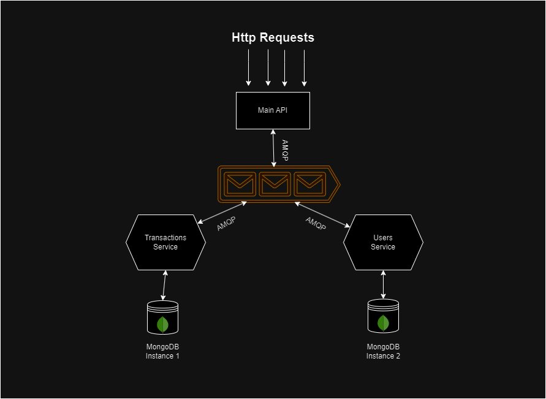

# Setup & Prerequisites

Developed on Node v19.0.0 & used npm 8.19.2

Donwload concurrently using npm i -g concurrently

## Notice!

### Before running this project you should run 2 seperated MongoDB instances (2 docker containers for example) and both of them should have a Replica set (at least one, single-mode)

---

## Project run steps:

    1. npm i
    2. npm run start:dev // will run all microservices

## Testing

I used Swagger for as my personal postman, as I love his great UI

http://localhost:3000/api - Will bring you to the Swagger's page

# Architecture

